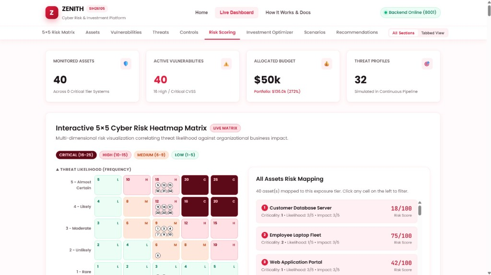

# Zenith — AI-Powered Cyber Risk Quantification & Investment Optimizer

**SIH26105 Security Platform** — Continuous cyber risk posture quantification, threat intelligence modeling, and data-driven security investment optimization.

<p align="center">
  
</p>

---

## 🌟 Key Features

- **One-Click Executive PDF / Audit Export**: Generate formal C-level cyber risk and compliance audit briefings (PDF / JSON / CSV) with letterheads, KPI scorecards, risk matrices, Knapsack budget ROI, regulatory standard mappings (NIST CSF 2.0, ISO 27001, SOC 2, CIS Controls), and CISO attestation signature blocks.
- **Interactive Inventory & Threat CRUD**: Register new enterprise digital assets, log CVE vulnerabilities with CVSS scores, map MITRE ATT&CK threat vectors, and deploy defensive controls via modal dialogs and live backend API sync.
- **Live Zero-Day Incident Simulation Sandbox**: Real-time adversary attack injection (Log4Shell RCE, FIN7 Ransomware, Layer-7 DDoS, Insider Exfiltration) streaming live telemetry signals, dynamically spiking risk scores and 5x5 heatmap quadrants, and computing instant Knapsack containment mitigations with one-click neutralization.
- **Continuous Risk Assessment**: Quantifies asset-level risk scores dynamically based on vulnerability severity (CVSS), threat likelihood, and business impact.
- **Enterprise Asset Inventory**: Centralized asset management tracking criticality tiers, valuation, and assigned SecOps ownership.
- **Threat Matrix & Vulnerability Intelligence**: Active tracking of CVE vulnerabilities, adversary vectors, and attack likelihood.
- **Knapsack Investment Optimization**: Algorithmic security budget allocation maximizing risk reduction ROI within defined budget constraints.
- **Monte Carlo Scenario Stress-Testing**: Simulated adversary attack scenarios comparing pre- and post-mitigation risk levels and financial ROI.
- **Prioritized Action Directives**: Actionable remediation recommendations sorted by urgency and risk mitigation impact.
- **Modern UI Design System**: Built with modern frosted glass aesthetic cards, responsive typography (`Poppins`), custom color tokens, and smooth anchor navigation.

---

## 🛠️ Technology Stack

| Layer | Technologies |
|---|---|
| **Backend** | Python 3.10+, FastAPI, Uvicorn, Pydantic, Python-dotenv |
| **Data & Math** | NumPy, Pandas, SQLite3 |
| **Frontend** | React 17/18, Vite, Vanilla CSS Design System (`Poppins` font) |
| **Architecture** | RESTful API with automated fallback telemetry |

---

## 📁 Repository Structure

```
zenith/
├── backend/
│   ├── zenith_backend/
│   │   ├── main.py                    # FastAPI application & route registration
│   │   ├── database.py                # SQLite schema & database operations
│   │   ├── risk_engine.py             # Risk calculation algorithms
│   │   ├── continuous_risk.py         # Continuous risk monitoring
│   │   ├── investment_optimizer.py    # Knapsack budget optimization
│   │   ├── scenario_analysis.py       # Stress testing & scenario simulation
│   │   └── recommendation_engine.py   # Prioritized recommendation generation
│   ├── requirements.txt               # Backend Python dependencies
│   └── start.py                       # Server runner utility
│
├── frontend/
│   ├── src/
│   │   ├── main.jsx                   # Root application & dashboard view
│   │   ├── ExecutiveReportModal.jsx   # One-Click C-level audit & PDF export
│   │   ├── CrudModals.jsx             # Asset, CVE, Threat & Control CRUD modals
│   │   ├── IncidentSimulator.jsx      # Live Zero-Day attack simulation sandbox
│   │   ├── LandingPage.jsx            # Platform landing showcase page
│   │   ├── HowItWorksPage.jsx         # Architecture guide & documentation
│   │   ├── RiskHeatmap.jsx            # Interactive 5x5 Cyber Risk Matrix
│   │   ├── VisualAnalytics.jsx        # Pareto frontier curve & distribution charts
│   │   ├── api.js                     # Backend API client with dynamic port fallback
│   │   └── index.css                  # Design system tokens & utility styles
│   ├── index.html                     # HTML root with Google Fonts (Poppins)
│   ├── package.json                   # Frontend dependencies & scripts
│   └── vite.config.js                 # Vite configuration
│
└── README.md
```

---

## 🚀 Getting Started

### Prerequisites
- **Python 3.10+**
- **Node.js 18+** & `npm`

---

### ⚡ Quick Start (Single Command / One-Click)

Run the root launcher batch script:
```cmd
.\start.bat
```
This automatically starts both the FastAPI backend (Port 8001) and Vite frontend (Port 5173), and opens `http://localhost:5173` in your browser.

---

### Manual Setup

1. Open a terminal and navigate to the `backend` folder:
   ```powershell
   cd backend
   ```

2. Install Python dependencies:
   ```powershell
   python -m pip install -r requirements.txt
   ```

3. Start the FastAPI server:
   ```powershell
   python -m uvicorn zenith_backend.main:app --reload --port 8000
   ```
   *(If port `8000` is in use, start on port `8001`)*:
   ```powershell
   python -m uvicorn zenith_backend.main:app --reload --port 8001
   ```

Backend API documentation will be available at:
- **Swagger UI**: `http://127.0.0.1:8000/docs` (or `:8001/docs`)
- **ReDoc**: `http://127.0.0.1:8000/redoc`

---

### 2. Frontend Setup

1. In a second terminal, navigate to the `frontend` folder:
   ```powershell
   cd frontend
   ```

2. Install npm dependencies:
   ```powershell
   npm install
   ```

3. Launch the Vite development server:
   ```powershell
   npm run dev
   ```

4. Open your browser and navigate to:
   ```
   http://localhost:5173
   ```

---

## 🔗 Direct Dashboard Section Navigation

You can jump directly to any section using URL hash anchors:

| Section | URL Hash |
|---|---|
| **Asset Inventory** | `http://localhost:5173/#assets` |
| **Vulnerabilities** | `http://localhost:5173/#vuln` |
| **Threat Matrix** | `http://localhost:5173/#threat` |
| **Security Controls** | `http://localhost:5173/#ctrl` |
| **Risk Scoring** | `http://localhost:5173/#risk` |
| **Investment Optimizer** | `http://localhost:5173/#invest` |
| **Scenario Simulator** | `http://localhost:5173/#scenario` |
| **Recommendations** | `http://localhost:5173/#rec` |

---

## 📡 Core API Endpoints

- `GET /api/v1/assets` — Retrieve list of monitored assets
- `GET /api/v1/vulnerabilities` — List discovered vulnerabilities & CVEs
- `GET /api/v1/threats` — Adversary threats & likelihood ratings
- `GET /api/v1/controls` — Defensive security controls
- `GET /api/v1/risk-assessments` — Quantitative risk scores per asset
- `GET /api/v1/investment-options` — Security investment packages & ROI metrics
- `GET /api/v1/scenarios` — Attack simulation scenarios
- `GET /api/v1/recommendations/prioritized` — Actionable security directives

## 🌐 Deploy to Vercel

The project is pre-configured for instant Vercel deployment (serving both the React SPA frontend and the Python FastAPI serverless functions):

### Quick Steps:
1. Push your repository to **GitHub** / **GitLab** / **Bitbucket**.
2. Go to [vercel.com](https://vercel.com) and click **"Add New Project"**.
3. Import your **`zenith`** repository.
4. Click **"Deploy"** (Vercel automatically detects [vercel.json](file:///c:/Users/tkart/OneDrive/Documents/zenith/zenith/vercel.json), builds the frontend, and packages `api/index.py` as serverless functions).

## 👥 Team & Contributors

| Member Name | Email | GitHub Profile |
|---|---|---|
| **Kamalika** | [km4758@srmist.edu.in](mailto:km4758@srmist.edu.in) | [@km4758](https://github.com/km4758) |

---

## 📄 License
Internal SIH26105 Project Prototype.